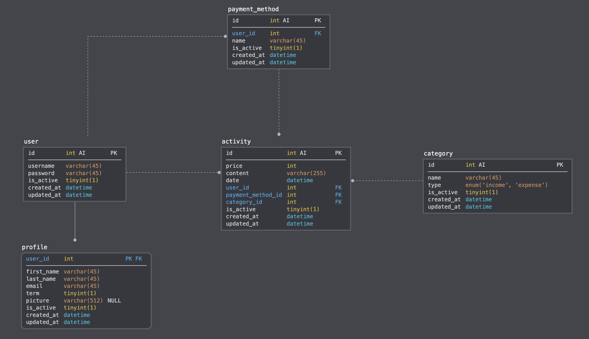

# hkb-7

> 우아한테크캠프 7조 - 추연호, 조성현


<div>
<a href="http://ec2-13-124-84-117.ap-northeast-2.compute.amazonaws.com:3000" target="_blank">

</a>
</div>

<div>
<a href="https://www.figma.com/file/mqsIurmk4qzCIrhhY04Sqo/HKB7?node-id=0%3A1" target="_blank">

</a>
</div>

## 기술 스택


## Quick Start

### 1. Clone & Install dependencies

```
git clone https://github.com/woowa-techcamp-2020/hkb-7.git
cd hkb-7
cd server
npm install
cd ../client
npm install
```

### 2. Add .env to server directory

> .env.sample

```
DB_HOST=
DB_USER=
DB_PASSWORD=
DB_NAME=
SALTROUNDS=
SESSION_SECRET=
```

### 3. Run server

```
cd server
npm start
```

### 4. Run Client

#### Dev

```
cd client
npm start
```

#### Prod

```
cd client
npm run build
```

## 프로젝트 구조

```
hkb-7
├── .github
│   ├── ISSUE_TEMPLATE.md
│   └── PULL_REQUEST_TEMPLATE.md
├── .gitignore
├── .prettierrc
├── README.md
├── build.sh
├── client
│   ├── babel.config.js
│   ├── dist
│   ├── node_modules
│   ├── package-lock.json
│   ├── package.json
│   ├── public
│   ├── src
│   ├── webpack.dev.js
│   └── webpack.prod.js
├── docs
│   └── images
├── server
│   ├── .env
│   ├── app.js
│   ├── bin
│   ├── controllers
│   ├── models
│   ├── node_modules
│   ├── package-lock.json
│   ├── package.json
│   ├── routes
│   └── utils
└── shared
    └── utils
```

### 데이터베이스 설계



## 자동 배포 스크립트 적용

> build.sh

```
#!/bin/bash
git fetch
local_hash=$(git rev-parse master)
remote_hash=$(git rev-parse origin/master)

if [ ${local_hash} != ${remote_hash} ];then
  git pull

  date
  echo "server restart"

  killall -9 node

  cd client
  npm install
  npm run build

  cd ../server
  npm install
  npm start
else
  echo "Nothing to do"
  exit 0
fi
```
